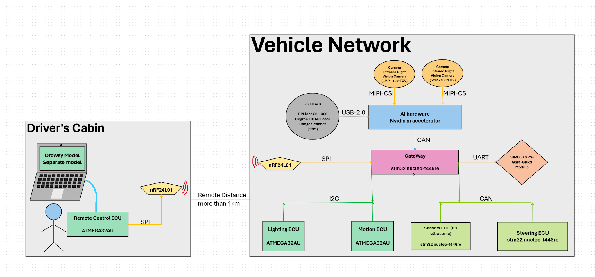
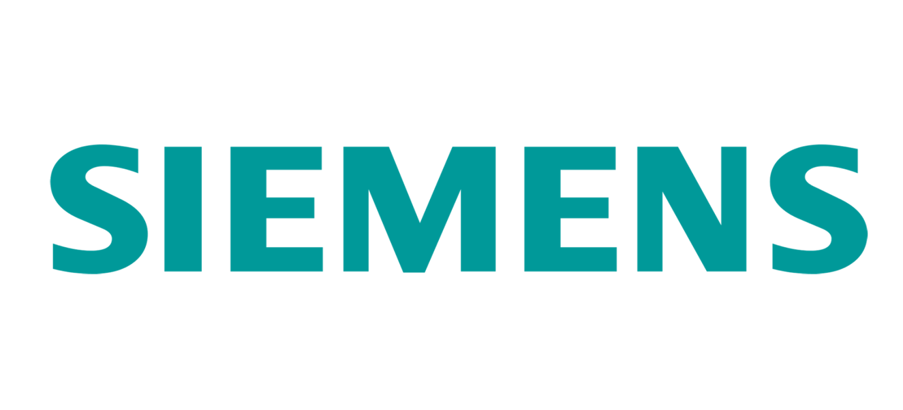

## 📂 Project Table of Contents

- [DGAS – Overview](#dgas--drowsy-guard-autopilot-system)  
- [Repository Description](#repository-description)  
- [System Concept](#system-concept)  
- [System Architecture](#system-architecture)  
  - [Lighting ECU](#lighting-ecu)  
  - [Motion ECU](#motion-ecu)  
  - [Steering ECU](#steering-ecu)  
  - [Gateway ECU](#gateway-ecu)  
  - [System Integration Layer](#system-integration-layer)  
- [Key Features](#key-features)  
- [Hardware Implementation](#hardware-implementation)  
- [Project Media](#project-media)  
- [Project Structure](#project-structure)  
- [Sponsorship](#sponsorship-and-support)  
- [License](#license)

---

# DGAS – Drowsy Guard Autopilot System

**DGAS (Drowsy Guard Autopilot System)** is a graduation project implementing a **distributed automotive embedded system** designed to detect driver drowsiness and respond by **safely parking the vehicle**.

The system follows a **multi-ECU architecture**, with independent Electronic Control Units (ECUs) managing lighting, motion, and steering, and communicating through a **central Gateway ECU**.  
DGAS is a **hardware-first project**, with full PCB design, embedded firmware, and integrated system-level operation, inspired by real-world automotive and ADAS systems.

---

## Repository Description

A complete **distributed automotive embedded system** for **driver drowsiness detection** and **controlled parking** using modular ECUs, central gateway coordination, and real PCBs.

---

## System Concept

DGAS continuously monitors the driver for signs of drowsiness.  
When drowsiness is detected, the system coordinates lighting, motion, and steering subsystems via the Gateway ECU to safely park the vehicle.

**Design Principles:**
- Distributed control and separation of concerns  
- Modular ECU-based architecture  
- Real PCB and embedded system implementation  
- Scalable and testable hardware-first design  

---

## System Architecture

### Lighting ECU
- Controls all vehicle lighting signals  
- Interfaces 12V automotive loads with 5V logic  
- Includes voltage regulation and protection  
- Real PCB designed, assembled, and tested

### Motion ECU
- Handles motion and motor actuation  
- Interfaced with motor drivers  
- Controls movement during autonomous parking  
- Firmware tested with motor driver board

### Steering ECU
- Manages steering actuation  
- Provides directional control during parking maneuvers  
- Supports modular integration

### Gateway ECU
- Central communication and coordination hub  
- Organizes data traffic between all ECUs  
- Ensures synchronized system operation

### System Integration Layer
- Power distribution and routing  
- ECU interconnection  
- System-level coordination for safe parking  

---

## Key Features

- Distributed ECU-based automotive architecture  
- Modular and scalable hardware  
- Custom PCB design and assembly  
- Safe-response behavior to driver drowsiness  
- Controlled autonomous parking action  
- Gateway-based system coordination  
- Fully documented hardware and firmware

---

## Hardware Implementation

- Multiple custom-designed PCBs  
- Each ECU is independent and testable individually  
- Modular wiring and connectors for system integration  
- Firmware implemented on each ECU  
- System tested on real hardware  

---

## Project Media

### DGAS Full System
  

### ECU Photos
- Individual ECU photos in `photos/` directory  
- Keypad, motor driver, lighting boards, etc.

### Videos
- System in operation: `photos/video_demo.mp4` (or upload to GitHub releases and link)

---

## Project Structure

```text
DGAS/
├── lighting_ecu/
│   ├── schematics/
│   ├── layouts/
│   ├── firmware/
│   ├── photos/
│   └── README.md
│
├── motion_ecu/
│   ├── schematics/
│   ├── layouts/
│   ├── firmware/
│   ├── photos/
│   └── README.md
│
├── steering_ecu/
│   ├── schematics/
│   ├── layouts/
│   ├── firmware/
│   ├── photos/
│   └── README.md
│
├── gateway_ecu/
│   ├── schematics/
│   ├── layouts/
│   ├── firmware/
│   ├── photos/
│   └── README.md
│
├── integration/
│   ├── system_diagrams/
│   ├── power_distribution/
│   └── notes/
│
├── photos/
│   ├── system_overview.jpg
│   ├── lighting_ecu.jpg
│   ├── motion_ecu.jpg
│   ├── steering_ecu.jpg
│   └── sponsors/
│       ├── kafr_el_sheikh_university.png
│       ├── kinnovia.png
│       ├── siemens.png
│       └── itida.png
│
├── README.md  <-- This file (all-inclusive)
└── NOTES.md  <-- Personal comments and design notes

```
---

## Sponsorship and Support

This project was developed with support from:

| Kafr El-Sheikh University | Kinnovia |
| :---:         |     :---:      |
| Academic supervision and laboratory resources | Embedded systems guidance and mentorship |
|  | 
| Siemens | ITIDA |
| Provided AI hardware platform for driver drowsiness detection | National technology and innovation support |
|  |  |

---

## License
This project is licensed under the MIT License.
