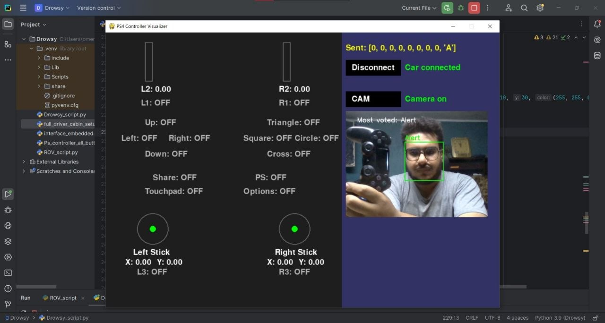

# Driver Cabin Controller

A Python-based bridge between an Arduino controller and an STM32 microcontroller for controlling a driver cabin system — including servo steering, motion, and lighting.



---

## Files

| File | Description |
|------|-------------|
| `Driver_Cabin_script.py` | Main script |
| `Driver_Cabin_photo.jpg` | Hardware photo |

---

## Hardware Setup

| Port | Device | Direction |
|------|--------|-----------|
| COM7 | Arduino | Read only (receives controller input) |
| COM10 | STM32 | Write only (sends commands) |

Both run at **115200 baud**.

---

## How It Works

1. The Arduino reads a physical controller and sends JSON packets over serial.
2. The Python script parses the packets and translates them into STM32 commands.
3. The STM32 drives the cabin hardware.

**JSON packet fields:**

- `driver_state` — `"D"` triggers emergency stop, `"A"` is normal operation
- `rx` — Steering input → servo angle command
- `buttons_high` — Motion buttons (forward, brake, etc.)
- `buttons_low` — Lighting buttons (5 toggleable lights)

---

## Features

- **Servo steering** — Maps `rx` value to a servo angle (`send_servo_angle`)
- **Motion control** — Controls drive and braking (`send_motion`)
- **Lighting control** — Toggles up to 5 independent light zones (`send_lighting`)
- **Emergency stop** — Immediately halts motion and triggers a safety signal
- **Manual GUI** — Tkinter window with `-15 / 0 / +15` degree buttons for testing

---

## Requirements

```bash
pip install pyserial
```

Python's `tkinter` is included in the standard library.

---

## Running

```bash
python Driver_Cabin_script.py
```

Make sure COM7 and COM10 are available and the devices are connected before launching.
