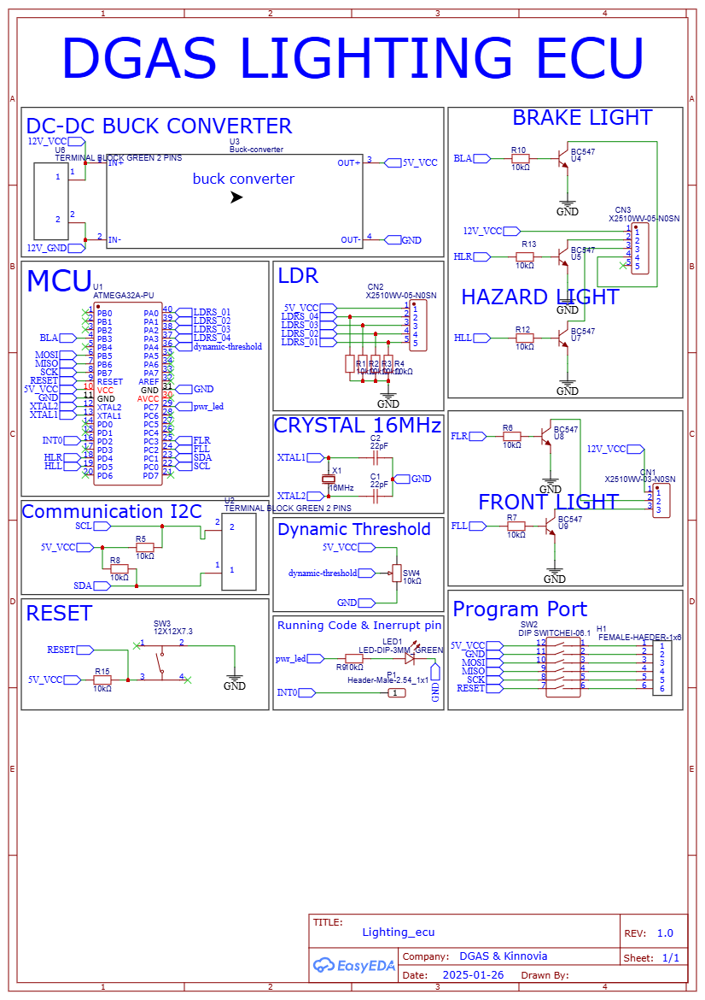
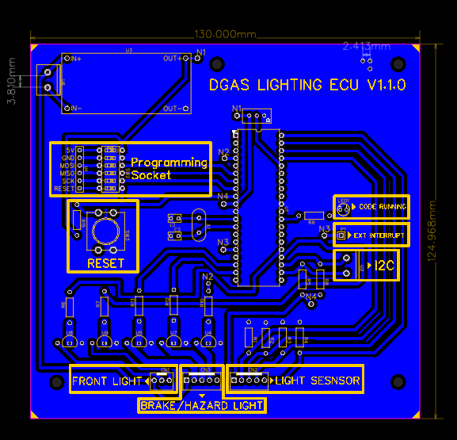
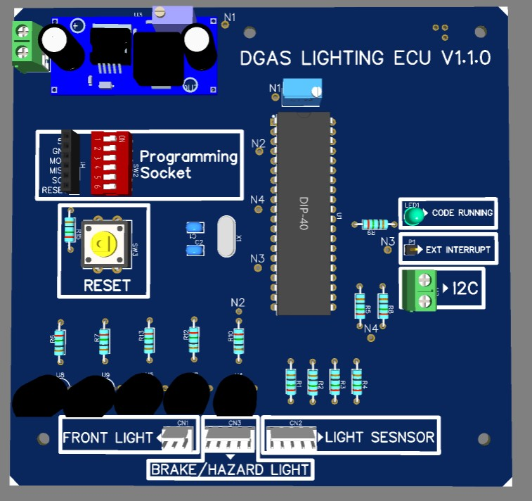
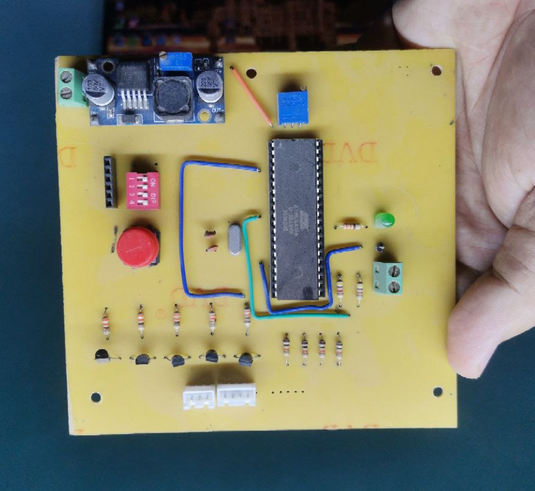

<div align="center">

# 🚗 Drowsy Guard Autopilot System
## Lighting ECU — Firmware & Hardware

[](https://www.microchip.com/en-us/products/microcontrollers-and-microprocessors/8-bit-mcus/avr-mcus)
[](https://en.wikipedia.org/wiki/I%C2%B2C)
[](https://en.wikipedia.org/wiki/C_(programming_language))
[](./lighting_ecu/layouts/)
[]()
[](./LICENSE)

<br/>

> **Part of the Drowsy Guard Autopilot System (DGAS) — A Graduation Project**
>
> *An intelligent, distributed automotive safety system designed to protect lives when the driver can no longer control the vehicle.*

</div>

---

## 📖 Table of Contents

- [Project Overview](#-project-overview)
- [Role of the Lighting ECU](#-role-of-the-lighting-ecu)
- [Key Features](#-key-features)
- [System Responsibilities](#-system-responsibilities)
- [Hardware Overview](#-hardware-overview)
- [Communication Architecture](#-communication-architecture)
- [Command Reference Table](#-command-reference-table)
- [Firmware Workflow](#-firmware-workflow)
- [Repository Structure](#-repository-structure)
- [PCB & Schematics](#-pcb--schematics)
- [Technologies Used](#-technologies-used)
- [Future Improvements](#-future-improvements)
- [License](#-license)

---

## 🧠 Project Overview

The **Drowsy Guard Autopilot System (DGAS)** is a distributed, real-time automotive safety platform developed as a graduation engineering project. It is designed to continuously monitor the driver for signs of **drowsiness or loss of consciousness**. Upon detection, DGAS autonomously takes control of the vehicle to prevent accidents by:

- 🔍 Detecting drowsiness through dedicated sensor ECUs
- 🚦 Activating warning signals and hazard lighting sequences
- 🛣️ Safely steering the vehicle toward the **emergency lane**
- 🛑 Performing a **controlled, gradual stop**
- 📡 Coordinating all actions across multiple ECUs via a **Master Gateway**

DGAS is built on a **modular multi-ECU architecture**, where each Electronic Control Unit (ECU) is responsible for a specific vehicle subsystem. All ECUs communicate over a shared **I2C bus** managed by the Master/Gateway ECU.

---

## 💡 Role of the Lighting ECU

Within the DGAS architecture, the **Lighting ECU** serves as the dedicated controller for all vehicle lighting functions during both **normal operation** and **autonomous emergency parking sequences**.

When the system detects driver incapacitation, the Master ECU orchestrates a safe-stop procedure. The Lighting ECU is a critical participant in this sequence — it receives lighting commands over I2C and executes them in real time, ensuring the vehicle communicates its state clearly to other road users through:

- Hazard warning indicators
- Emergency flashing modes
- Brake light intensity control
- Front directional lighting

---

## ✨ Key Features

- **Interrupt-Driven I2C Reception** — Non-blocking communication ensures the MCU remains responsive while awaiting commands from the Master ECU
- **Full Lighting Control Suite** — Individual and grouped control over front lights, brake lights, and hazard lights
- **Emergency Hazard Flash Mode** — Dedicated emergency flashing sequence for critical safety scenarios
- **Brake Light Intensity Management** — Supports full-intensity braking state and default standby state
- **Startup Diagnostic Indication** — Debug LED blinks on boot to confirm system initialization
- **LDR Integration** — Light Dependent Resistor services initialized for ambient light awareness
- **Custom PCB Design** — Purpose-built hardware for reliable automotive-grade integration
- **Modular Service Architecture** — Lighting and LDR services are independently initialized for maintainability

---

## 🔧 System Responsibilities

| Responsibility | Description |
|---|---|
| Front Light Control | Independent ON/OFF control of left and right front lights, plus grouped control |
| Brake Light Control | Full intensity activation for emergency braking, default state for normal driving |
| Hazard Light Control | Individual left/right hazard control, grouped activation, and emergency flash mode |
| I2C Command Reception | Receives and processes 1-byte command codes from the Master ECU via interrupt |
| Startup Diagnostics | Blinks debug LED 3 times on boot to confirm firmware is running |
| LDR Service Init | Initializes ambient light sensing for adaptive lighting decisions |

---

## 🔩 Hardware Overview

The Lighting ECU is built on a **custom-designed PCB** powered by an **AVR microcontroller**. The hardware is purpose-designed for the DGAS project with all necessary interfacing for automotive lighting loads and I2C communication.

| Parameter | Value |
|---|---|
| Microcontroller | AVR (ATmega series) |
| PCB | Custom designed, v1.0.0 |
| Communication | I2C (TWI peripheral) |
| Operating Mode | I2C Slave |
| Slave Address | `0x60` |
| Interrupt Mode | TWI Interrupt-Driven |
| Debug Interface | GPIO — PC7 Debug LED |
| Lighting Outputs | Front Lights (L/R), Brake Lights, Hazard Lights (L/R) |
| Sensing Input | LDR (Light Dependent Resistor) |

---

## 📡 Communication Architecture

The Lighting ECU operates as a **dedicated I2C slave** on the DGAS vehicle bus. All commands originate from the **Master/Gateway ECU** and are dispatched as single-byte opcodes.

```
┌─────────────────────────────────────────────────────────────┐
│                   DGAS System Bus (I2C)                     │
│                                                             │
│  ┌──────────────┐     SDA/SCL     ┌────────────────────┐    │
│  │  Master /    │ ◄────────────── │   Lighting ECU     │    │
│  │  Gateway ECU │ ──────────────► │   Slave @ 0x60     │    │
│  └──────────────┘                 └────────────────────┘    │
│         │                                  │                │
│         │                    ┌─────────────┼──────────┐     │
│         │                    ▼             ▼          ▼     │
│         │             Front Lights   Brake Lights  Hazards  │
│         │                                                   │
│  ┌──────┴──────┐                                            │
│  │  Other ECUs │  (Steering, Braking, Sensing...)           │
│  └─────────────┘                                            │
└─────────────────────────────────────────────────────────────┘
```

**Communication Protocol:**

- **Bus Type:** I2C (TWI)
- **Role:** Slave
- **Address:** `0x60` (7-bit)
- **Data Format:** Single byte command code per transaction
- **Reception:** Interrupt-driven via `TWI ISR`
- **Clock:** Configured by Master ECU

The ISR reads the incoming byte from `TWDR` into a volatile `rx_buffer`. The main loop continuously polls `rx_buffer` and dispatches the appropriate lighting function, then clears the buffer to await the next command.

---

## 📋 Command Reference Table

All commands are single-byte values sent by the Master ECU to Slave Address `0x60`.

### Front Lights

| Command | Hex Code | Description |
|---|---|---|
| Front Right Light ON | `0x80` | Activates the right front light |
| Front Right Light OFF | `0x81` | Deactivates the right front light |
| Front Left Light ON | `0x82` | Activates the left front light |
| Front Left Light OFF | `0x83` | Deactivates the left front light |
| All Front Lights ON | `0x84` | Activates both front lights simultaneously |
| All Front Lights OFF | `0x85` | Deactivates both front lights simultaneously |

### Brake Lights

| Command | Hex Code | Description |
|---|---|---|
| Brake Light Full Intensity | `0x86` | Activates full-brightness brake light (emergency stop) |
| Brake Light Default State | `0x87` | Restores brake light to default standby state |

### Hazard Lights

| Command | Hex Code | Description |
|---|---|---|
| Right Hazard ON | `0x88` | Activates right hazard indicator |
| Right Hazard OFF | `0x89` | Deactivates right hazard indicator |
| Left Hazard ON | `0x8A` | Activates left hazard indicator |
| Left Hazard OFF | `0x8B` | Deactivates left hazard indicator |
| All Hazards ON | `0x8C` | Activates all hazard indicators |
| All Hazards OFF | `0x8D` | Deactivates all hazard indicators |
| Emergency Hazard Mode ON | `0x8E` | Activates emergency flashing pattern |
| Emergency Hazard Mode OFF | `0x8F` | Deactivates emergency flashing pattern |

---

## ⚙️ Firmware Workflow

The firmware follows a straightforward **interrupt + polling** execution model designed for reliability in real-time automotive applications.

```
                        ┌─────────────────────┐
                        │      Power ON        │
                        └──────────┬──────────┘
                                   │
                        ┌──────────▼───────────┐
                        │  application_init()  │
                        │  - Lighting Services │
                        │  - Brake Default     │
                        │  - LDR Services      │
                        │  - I2C Slave Init    │
                        └──────────┬───────────┘
                                   │
                        ┌──────────▼───────────┐
                        │  Blink LED x3        │
                        │  (Startup Confirm)   │
                        └──────────┬───────────┘
                                   │
              ┌────────────────────▼────────────────────────────┐
              │                Main Loop                        │
              │                                                 │
              │   poll rx_buffer ──► switch(rx_buffer)          │
              │                           │                     │
              │           ┌───────────────┼──────────────┐      │
              │           ▼               ▼              ▼      │
              │      0x80–0x85       0x86–0x87      0x88–0x8F   │
              │      Front Lights    Brake Lights   Hazard      │
              │           │               │              │      │
              │           └───────────────┴──────────────┘      │
              │                           │                     │
              │              Execute Function + Clear Buffer    │
              └─────────────────────────────────────────────────┘
                                   ▲
                    ┌──────────────┴───────────────────┐
                    │     TWI Interrupt (ISR)          │
                    │                                  │
                    │  Read TWSR status register       │
                    │  If data byte received:          │
                    │    rx_buffer = TWDR              │
                    │    Blink debug LED x1            │
                    └──────────────────────────────────┘
```

**Step-by-step description:**

1. **Initialization** — On startup, lighting services, brake defaults, LDR services, and the I2C slave peripheral are all configured. The debug LED blinks 3 times to confirm successful boot.

2. **I2C Interrupt Service Routine** — When the Master ECU sends a command byte to address `0x60`, the TWI peripheral fires an interrupt. The ISR reads the TWI status register (`TWSR`), validates the condition, stores the received byte in `rx_buffer`, and blinks the debug LED once as a reception indicator.

3. **Main Loop Dispatch** — The `while(1)` loop continuously checks `rx_buffer`. When a recognized command is present, the corresponding lighting service function is called and `rx_buffer` is immediately cleared to signal readiness for the next command.

4. **Unknown Commands** — Any unrecognized byte falls through to the `default` case, which is a no-op. The buffer remains set — future implementations may add error reporting here.

---

## 📁 Repository Structure

```
lighting_ecu/
│
├── schematics/
│   └── Schematic_DGAS-ECUs-Lighting.png       # Full electrical schematic
│
├── layouts/
│   └── PCB_DGAS_LIGHTING_ECU_V1.0.0.png       # PCB layout (Gerber preview)
│
├── firmware/
│   ├── lighting_ecu_slave.c                    # Main application firmware
│   ├── application.h                           # Application header
│   ├── i2c.h                                   # TWI/I2C peripheral driver
│   └── ...                                     # Lighting & LDR service modules
│
├── photos/
│   ├── PCB_3D.jpg                              # 3D render of the PCB
│   └── PCB_Real.png                            # Photograph of the manufactured PCB
│
└── README.md                                   # This file
```

---

## 🖼️ PCB & Schematics

### Electrical Schematic

> Full circuit schematic showing microcontroller connections, lighting outputs, LDR input, and I2C bus lines.



---

### PCB Layout — v1.0.0

> Top-view PCB layout showing component placement and routing.



---

### 3D PCB Render

> 3D model preview of the assembled PCB.



---

### Manufactured PCB

> Photograph of the real, manufactured Lighting ECU board.



---

## 🛠️ Technologies Used

| Category | Technology |
|---|---|
| Microcontroller | AVR (ATmega series) |
| Firmware Language | Embedded C (C99) |
| Communication Protocol | I2C / TWI |
| Interrupt Architecture | Hardware TWI ISR |
| PCB Design | EDA Tool (KiCad / Altium / EasyEDA) |
| Build Toolchain | AVR-GCC / Atmel Studio / MPLAB |
| Debugging | GPIO Debug LED, UART (optional) |
| Sensing | LDR (Light Dependent Resistor) |

---

## 🔮 Future Improvements

- [ ] **CAN Bus Migration** — Upgrade from I2C to CAN bus for higher noise immunity and longer cable runs suitable for real automotive environments
- [ ] **PWM Brightness Control** — Replace binary ON/OFF with PWM-driven dimming for adaptive lighting and smooth transitions
- [ ] **Fault Detection & Reporting** — Implement open-circuit and short-circuit detection on lighting outputs with error codes reported back to Master ECU
- [ ] **EEPROM Configuration** — Store lighting behavior profiles in EEPROM for runtime configurability without firmware re-flashing
- [ ] **AUTOSAR-style Layering** — Refactor firmware into AUTOSAR-aligned MCAL/BSW/Application layers for portability across MCU platforms
- [ ] **Unit Testing Framework** — Introduce a hardware abstraction layer (HAL) to enable off-target unit testing with a PC-based test harness
- [ ] **Watchdog Timer Integration** — Add WDT supervision to recover from software hang states autonomously
- [ ] **Daytime Running Lights (DRL)** — Extend command set to support DRL sequences required by modern vehicle regulations

---

## 📄 License

```
MIT License

Copyright (c) 2025 DGAS Team

Permission is hereby granted, free of charge, to any person obtaining a copy
of this software and associated documentation files (the "Software"), to deal
in the Software without restriction, including without limitation the rights
to use, copy, modify, merge, publish, distribute, sublicense, and/or sell
copies of the Software, and to permit persons to whom the Software is
furnished to do so, subject to the following conditions:

The above copyright notice and this permission notice shall be included in all
copies or substantial portions of the Software.

THE SOFTWARE IS PROVIDED "AS IS", WITHOUT WARRANTY OF ANY KIND, EXPRESS OR
IMPLIED, INCLUDING BUT NOT LIMITED TO THE WARRANTIES OF MERCHANTABILITY,
FITNESS FOR A PARTICULAR PURPOSE AND NONINFRINGEMENT.
```

---

<div align="center">

**Drowsy Guard Autopilot System — Lighting ECU**

*Built with precision. Designed for safety.*

[]()

</div>
