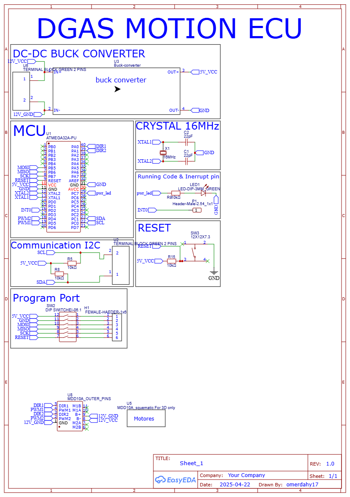
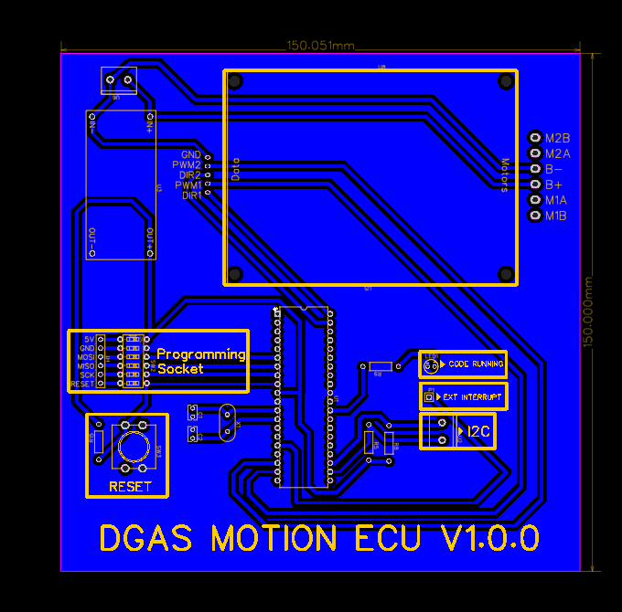
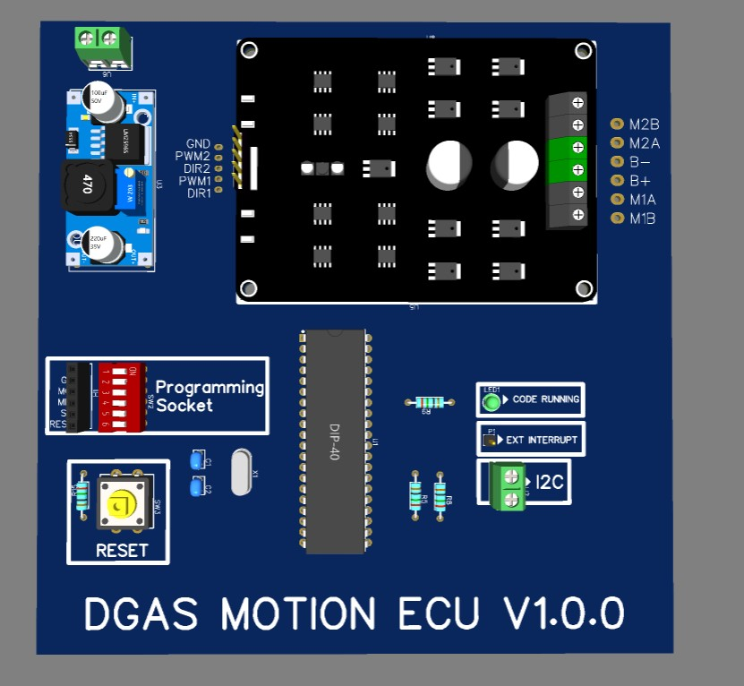
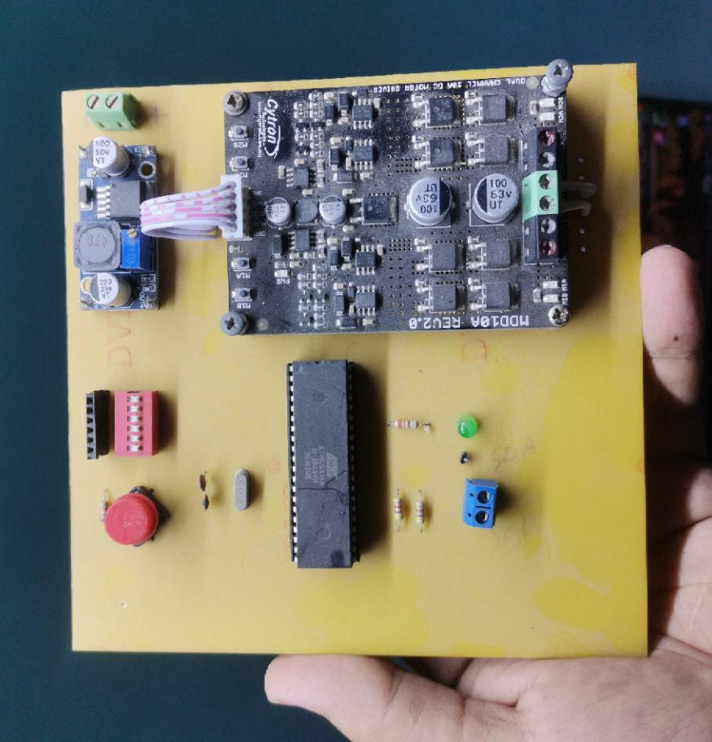

<div align="center">

# 🚗 Drowsy Guard Autopilot System
## Motion ECU — Firmware & Hardware

[](https://www.microchip.com/en-us/products/microcontrollers-and-microprocessors/8-bit-mcus/avr-mcus)
[](https://en.wikipedia.org/wiki/I%C2%B2C)
[](https://en.wikipedia.org/wiki/C_(programming_language))
[](https://www.cytron.io/p-10amp-5v-30v-dc-motor-driver-2-channels)
[](./motion_ecu/layouts/)
[]()
[](./LICENSE)

<br/>

> **Part of the Drowsy Guard Autopilot System (DGAS) — A Graduation Project**
>
> *An intelligent, distributed automotive safety system designed to protect lives when the driver can no longer control the vehicle.*

</div>

---

## 📖 Table of Contents

- [Project Overview](#-project-overview)
- [Role of the Motion ECU](#-role-of-the-motion-ecu)
- [Key Features](#-key-features)
- [System Responsibilities](#-system-responsibilities)
- [Hardware Overview](#-hardware-overview)
- [Motor Driver Overview](#-motor-driver-overview)
- [Communication Architecture](#-communication-architecture)
- [Motion Command Reference Table](#-motion-command-reference-table)
- [Firmware Workflow](#-firmware-workflow)
- [Repository Structure](#-repository-structure)
- [PCB & Schematics](#-pcb--schematics)
- [Technologies Used](#-technologies-used)
- [Future Improvements](#-future-improvements)
- [License](#-license)

---

## 🧠 Project Overview

The **Drowsy Guard Autopilot System (DGAS)** is a distributed, real-time automotive safety platform developed as a graduation engineering project. It is designed to continuously monitor the driver for signs of **drowsiness or loss of consciousness**. Upon detection, DGAS autonomously takes control of the vehicle to prevent accidents by:

- 🔍 Detecting drowsiness through dedicated sensor ECUs
- 🚦 Activating warning signals and hazard lighting sequences
- 🛣️ Safely steering the vehicle toward the **emergency lane**
- 🛑 Performing a **controlled, gradual stop**
- 📡 Coordinating all actions across multiple ECUs via a **Master Gateway**

DGAS is built on a **modular multi-ECU architecture**, where each Electronic Control Unit (ECU) is responsible for a specific vehicle subsystem. All ECUs communicate over a shared **I2C bus** managed by the Master/Gateway ECU.

---

## ⚙️ Role of the Motion ECU

Within the DGAS architecture, the **Motion ECU** serves as the dedicated propulsion controller for all vehicle movement operations during both **normal operation** and **autonomous emergency parking sequences**.

When the system detects driver incapacitation, the Master/Gateway ECU orchestrates a controlled safe-stop procedure. The Motion ECU is a critical actuator node in this chain — it receives motion command bytes over I2C and immediately drives the motor outputs to execute the commanded maneuver with precision. This ECU is directly responsible for:

- Translating high-level motion commands into real-time motor control signals
- Managing bidirectional drive for forward propulsion and reverse maneuvers
- Executing clean, controlled deceleration and stop sequences
- Supporting independent per-motor control for differential steering assistance

---

## ✨ Key Features

- **Interrupt-Driven I2C Reception** — Non-blocking TWI communication ensures the MCU remains fully responsive between commands from the Gateway ECU
- **Dual Motor Control** — Independent and grouped control of two DC drive motors via the Cytron MDD10A dual-channel driver
- **Bidirectional Drive Support** — Forward (clockwise) and reverse (counter-clockwise) motion modes for both motors
- **Speed Control Functionality** — Dedicated command for applying preconfigured speed settings to motor outputs
- **Independent Motor Commands** — Per-motor direction and stop control enabling differential-style maneuverability
- **Grouped Stop Command** — Simultaneous halt of both motors for emergency stop execution
- **Startup Diagnostic Indication** — Debug LED blinks on boot to confirm firmware initialization and MCU health
- **Modular Embedded Software Architecture** — Clean separation of application logic, motor services, and I2C driver layers
- **Custom PCB Design** — Purpose-built hardware integrating the AVR MCU and motor driver interface on a single board

---

## 🔧 System Responsibilities

| Responsibility | Description |
|---|---|
| Dual Motor Drive | Controls both DC drive motors independently or as a grouped pair |
| Forward Motion | Commands both motors clockwise for vehicle forward propulsion |
| Reverse Motion | Commands both motors counter-clockwise for reverse maneuvers |
| Vehicle Stop | Simultaneous stop command for controlled deceleration and halt |
| Motor 1 Control | Independent direction (CW / CCW) and stop control for Motor 1 |
| Motor 2 Control | Independent direction (CW / CCW) and stop control for Motor 2 |
| Speed Setting | Applies the current speed configuration to active motor outputs |
| I2C Command Reception | Receives and decodes 1-byte command opcodes from the Gateway ECU via interrupt |
| Startup Diagnostics | Blinks debug LED on boot to confirm firmware is running and MCU is healthy |

---

## 🔩 Hardware Overview

The Motion ECU is built on a **custom-designed PCB** integrating an **AVR microcontroller** with the **Cytron MDD10A** dual-channel DC motor driver. The board is purpose-designed for the DGAS project, providing a compact and robust motor drive interface with I2C connectivity to the vehicle bus.

| Parameter | Value |
|---|---|
| Microcontroller | AVR (ATmega series) |
| PCB | Custom designed, v1.0.0 |
| Motor Driver | Cytron MDD10A — Dual Channel 10A DC |
| Communication | I2C (TWI peripheral) |
| Operating Mode | I2C Slave |
| Slave Address | `0x62` |
| Interrupt Mode | TWI Interrupt-Driven |
| Debug Interface | GPIO Debug LED |
| Motor Outputs | Dual DC Motor channels (Motor 1 & Motor 2) |
| Motor Driver Supply | 5V – 30V operating range |
| Motor Control Mode | PWM speed + direction signal |

---

## 🔌 Motor Driver Overview

The **Cytron MDD10A** was selected as the motor driver for the Motion ECU based on its suitability for prototype-scale automotive drive systems and its compatibility with AVR PWM outputs.

| Specification | Value |
|---|---|
| Model | Cytron MDD10A |
| Channels | 2 (Dual Channel) |
| Continuous Current per Channel | 10A |
| Operating Voltage | 5V – 30V DC |
| Control Interface | PWM + Direction signal |
| Motor Types Supported | Brushed DC Motors |
| Protection Features | Overcurrent, thermal shutdown |

**Why Cytron MDD10A?**

- **Dual-channel in a single package** eliminates the need for two separate driver boards, reducing PCB footprint and wiring complexity
- **10A per channel** provides sufficient headroom for the DC drive motors used in the DGAS test platform without thermal stress
- **PWM + DIR control interface** maps directly to AVR timer PWM outputs, enabling clean firmware integration with no additional logic
- **Wide voltage range (5V–30V)** accommodates different motor supply configurations during development and testing phases
- **Built-in protection circuitry** provides overcurrent and thermal shutdown safeguards that are essential in an autonomous vehicle application where fault scenarios must be handled gracefully

---

## 📡 Communication Architecture

The Motion ECU operates as a **dedicated I2C slave** on the DGAS vehicle bus. All motion commands originate from the **Master/Gateway ECU** and are dispatched as single-byte opcodes targeted at slave address `0x62`.

```
┌──────────────────────────────────────────────────────────────────┐
│                     DGAS System Bus (I2C)                        │
│                                                                  │
│  ┌──────────────┐      SDA/SCL      ┌──────────────────────┐     │
│  │  Master /    │ ◄──────────────── │    Motion ECU        │     │
│  │  Gateway ECU │ ─────────────────►│    Slave @ 0x62      │     │
│  └──────────────┘                   └──────────────────────┘     │
│         │                                      │                 │
│         │                       ┌──────────────┴──────────┐      │
│         │                       ▼                         ▼      │
│         │                 ┌───────────┐           ┌───────────┐  │
│         │                 │  Motor 1  │           │  Motor 2  │  │
│         │                 │  (CW/CCW) │           │  (CW/CCW) │  │
│         │                 └───────────┘           └───────────┘  │
│         │                       │                         │      │
│         │                       └────────────┬────────────┘      │
│         │                                    ▼                   │
│         │                          Cytron MDD10A                 │
│         │                          Dual Motor Driver             │
│  ┌──────┴──────┐                                                 │
│  │  Other ECUs │  (Lighting, Steering, Sensing...)               │
│  └─────────────┘                                                 │
└──────────────────────────────────────────────────────────────────┘
```

**Communication Protocol Summary:**

| Parameter | Value |
|---|---|
| Bus Type | I2C (TWI) |
| ECU Role | Slave |
| Slave Address | `0x62` (7-bit) |
| Data Format | Single byte command opcode per transaction |
| Reception Method | Interrupt-driven TWI ISR |
| Clock Source | Configured and controlled by Master ECU |

The TWI ISR captures each incoming byte from `TWDR` into a volatile `rx_buffer`. The main application loop polls `rx_buffer`, decodes the command, dispatches the corresponding motor control function, and clears the buffer to accept the next instruction.

---

## 📋 Motion Command Reference Table

All commands are single-byte values sent by the Master/Gateway ECU to Slave Address `0x62`.

### Speed & Group Commands

| Command | Hex Code | Description |
|---|---|---|
| Apply Speed Setting | `0x81` | Applies the current speed configuration to active motor outputs |
| Both Motors Clockwise | `0x82` | Drives both motors forward (clockwise direction) |
| Both Motors Counter-Clockwise | `0x83` | Drives both motors in reverse (counter-clockwise direction) |
| Stop Both Motors | `0x84` | Immediately halts both motors |

### Motor 1 Commands

| Command | Hex Code | Description |
|---|---|---|
| Motor 1 Clockwise | `0x85` | Drives Motor 1 in the clockwise (forward) direction |
| Motor 1 Counter-Clockwise | `0x86` | Drives Motor 1 in the counter-clockwise (reverse) direction |
| Stop Motor 1 | `0x87` | Immediately halts Motor 1 |

### Motor 2 Commands

| Command | Hex Code | Description |
|---|---|---|
| Motor 2 Clockwise | `0x88` | Drives Motor 2 in the clockwise (forward) direction |
| Motor 2 Counter-Clockwise | `0x89` | Drives Motor 2 in the counter-clockwise (reverse) direction |
| Stop Motor 2 | `0x8A` | Immediately halts Motor 2 |

---

## ⚙️ Firmware Workflow

The firmware follows an **interrupt + polling** execution model — a proven pattern for deterministic, reliable command processing in embedded automotive systems.

```
                        ┌─────────────────────┐
                        │       Power ON      │
                        └──────────┬──────────┘
                                   │
                        ┌──────────▼───────────┐
                        │  application_init()  │
                        │  - Motor Services    │
                        │  - I2C Slave Init    │
                        │    (Address: 0x62)   │
                        │  - Interrupt Enable  │
                        └──────────┬───────────┘
                                   │
                        ┌──────────▼───────────┐
                        │  Blink Debug LED     │
                        │  (Startup Confirm)   │
                        └──────────┬───────────┘
                                   │
        ┌──────────────────────────▼────────────────────────────────┐
        │                       Main Loop                           │
        │                                                           │
        │   poll rx_buffer  ──►  switch(rx_buffer)                  │
        │                               │                           │
        │        ┌──────────────────────┼─────────────────┐         │
        │        ▼                      ▼                  ▼        │
        │   0x81–0x84             0x85–0x87           0x88–0x8A     │
        │   Group / Speed         Motor 1 Cmds        Motor 2 Cmds  │
        │        │                      │                  │        │
        │        └──────────────────────┴─────────────────┘         │
        │                               │                           │
        │              Execute Motor Function + Clear rx_buffer     │
        └───────────────────────────────────────────────────────────┘
                                   ▲
              ┌────────────────────┴─────────────────────────┐
              │          TWI Interrupt Handler (ISR)         │
              │                                              │
              │  1. Read TWSR — validate I2C status code     │
              │  2. Check TWDR for valid data condition      │
              │  3. Store received byte → rx_buffer          │
              │  4. Blink debug LED x1 (reception confirm)   │
              │  5. Return — main loop dispatches action     │
              └──────────────────────────────────────────────┘
```

**Detailed execution flow:**

**1 — Initialization**
On power-up, `application_initialize()` configures the motor driver service layer, registers the TWI interrupt handler, sets the slave address to `0x62`, and enables global interrupts. The debug LED performs a startup blink sequence to confirm the firmware is running and the MCU is healthy.

**2 — I2C Command Reception (ISR)**
When the Gateway ECU addresses this slave and transmits a command byte, the TWI peripheral fires a hardware interrupt. The ISR reads the TWI status register (`TWSR`) to validate the transaction state. If a valid data-received condition is confirmed, the byte is latched from `TWDR` into the volatile `rx_buffer` and the debug LED blinks once as a visual reception indicator.

**3 — Command Decoding (Main Loop)**
The `while(1)` loop continuously polls `rx_buffer`. When a non-zero value is present, it is evaluated against the known command opcode table via a `switch` statement. Recognized opcodes are dispatched to the corresponding motor service function.

**4 — Motor Control Execution**
The motor service layer translates each decoded command into the appropriate PWM and direction signals for the Cytron MDD10A driver. Each motor channel receives an independent direction pin state and PWM duty cycle, enabling precise control of speed and rotational direction.

**5 — Buffer Clear & Ready State**
After the motor function executes, `rx_buffer` is immediately cleared to zero, signaling readiness to receive and process the next command from the Gateway ECU.

**6 — Unknown Commands**
Any unrecognized opcode falls through to the `default` case, which is a safe no-op. Motor outputs retain their last commanded state until a valid command is received.

---

## 📁 Repository Structure

```
motion_ecu/
│
├── schematics/
│   └── Schematic_DGAS-ECUs-MOTION.png          # Full electrical schematic
│
├── layouts/
│   └── PCB_DGAS_MOTION_ECU_V1.0.0_2.png        # PCB layout (Gerber preview)
│
├── firmware/
│   ├── main.c                                   # Entry point, main loop & I2C ISR
│   └── ...                                      # Motor driver, I2C, and service modules
│
├── photos/
│   ├── PCB_3D.jpg                               # 3D render of the PCB
│   └── photo_2026-06-06_21-55-20.png            # Photograph of the manufactured PCB
│
└── README.md                                    # This file
```

---

## 🖼️ PCB & Schematics

### Electrical Schematic

> Full circuit schematic showing MCU connections, Cytron MDD10A motor driver interface, motor outputs, and I2C bus lines.



---

### PCB Layout — v1.0.0

> Top-view PCB layout showing component placement and signal routing.



---

### 3D PCB Render

> 3D model preview of the fully assembled Motion ECU board.



---

### Manufactured PCB

> Photograph of the real, manufactured Motion ECU board.



---

## 🛠️ Technologies Used

| Category | Technology |
|---|---|
| Microcontroller | AVR (ATmega series) |
| Firmware Language | Embedded C (C99) |
| Communication Protocol | I2C / TWI |
| Interrupt Architecture | Hardware TWI ISR |
| Motor Driver | Cytron MDD10A — Dual Channel 10A DC |
| Motor Control Interface | PWM + Direction signal |
| PCB Design | EDA Tool (KiCad / Altium / EasyEDA) |
| Build Toolchain | AVR-GCC / Atmel Studio / MPLAB |
| Debugging | GPIO Debug LED |

---

## 🔮 Future Improvements

- [ ] **CAN Bus Migration** — Upgrade from I2C to CAN bus for improved noise immunity, longer cable runs, and real automotive-grade reliability
- [ ] **Closed-Loop Speed Control** — Integrate motor encoders and a PID controller for precise speed regulation and consistent vehicle velocity under varying load conditions
- [ ] **Motor Fault Detection** — Implement stall detection, overcurrent monitoring, and fault reporting back to the Gateway ECU for fail-safe operation
- [ ] **Smooth Acceleration Profiles** — Replace instantaneous speed transitions with configurable ramp-up and ramp-down profiles to reduce mechanical stress and improve passenger comfort
- [ ] **Configurable Speed Levels** — Extend the command set to support multiple named speed tiers (e.g., slow, cruise, emergency) settable by the Gateway ECU at runtime
- [ ] **EEPROM Speed Profile Storage** — Persist speed and motion configuration profiles in EEPROM for retention across power cycles
- [ ] **Watchdog Timer Integration** — Add hardware WDT supervision to autonomously recover from software hang states — critical for a safety system
- [ ] **AUTOSAR-style Software Layering** — Refactor firmware into MCAL / BSW / Application layers for cross-platform portability and maintainability

---

## 📄 License

```
MIT License

Copyright (c) 2025 DGAS Team

Permission is hereby granted, free of charge, to any person obtaining a copy
of this software and associated documentation files (the "Software"), to deal
in the Software without restriction, including without limitation the rights
to use, copy, modify, merge, publish, distribute, sublicense, and/or sell
copies of the Software, and to permit persons to whom the Software is
furnished to do so, subject to the following conditions:

The above copyright notice and this permission notice shall be included in all
copies or substantial portions of the Software.

THE SOFTWARE IS PROVIDED "AS IS", WITHOUT WARRANTY OF ANY KIND, EXPRESS OR
IMPLIED, INCLUDING BUT NOT LIMITED TO THE WARRANTIES OF MERCHANTABILITY,
FITNESS FOR A PARTICULAR PURPOSE AND NONINFRINGEMENT.
```

---

<div align="center">

**Drowsy Guard Autopilot System — Motion ECU**

*Built with precision. Designed for safety.*

[]()

</div>
