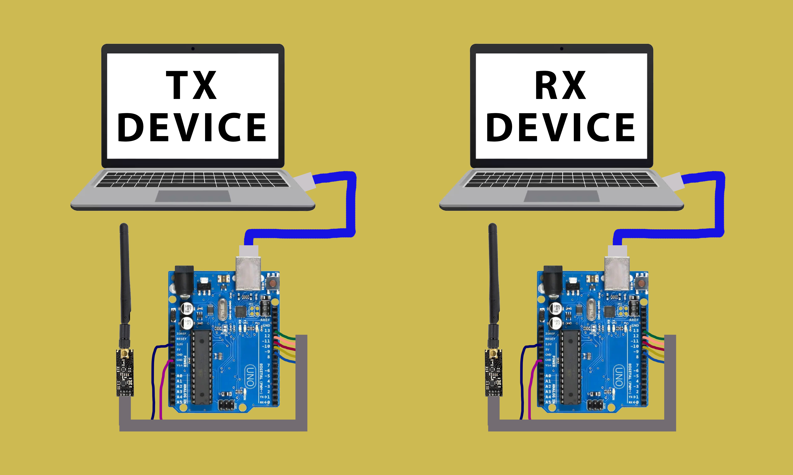

# Wireless Button-Controlled LEDs (nRF24L01)

A simple two-board wireless system: a transmitter reads button presses and sends them over an nRF24L01 radio module, and a receiver lights up LEDs based on the received value.

---

## Files

| File | Description |
|------|-------------|
| `Tx_firmware/tx_code.ino` | Transmitter — reads 3 buttons, sends values wirelessly |
| `Rx_firmware/rx_code.ino` | Receiver — controls 2 LEDs based on received values |
| `wireless/wireless_connection.png` | Wiring/connection diagram |

---

## Hardware

- 2x Arduino boards
- 2x nRF24L01 radio modules (CE → pin 9, CSN → pin 10, SPI)
- TX side: 3 buttons (pins 3, 4, 5, `INPUT_PULLUP`)
- RX side: 2 LEDs (pins A0, A1)

Both modules use radio address `"00002"`.

---

## How It Works

1. **TX board** continuously reads the state of 3 buttons.
2. When a button state changes, it sends a value over the radio:
   - Button 1 → `5`
   - Button 2 → `10`
   - Button 3 → `15`
3. **RX board** listens for incoming values and controls LEDs:
   - `1` → LED1 ON
   - `0` → LED1 OFF
   - `3` → LED2 ON
   - `2` → LED2 OFF

> ⚠️ Note: TX sends `0/5/10/15`, while RX checks for `0/1/2/3`. Make sure the value mapping matches between TX and RX for the LEDs to respond correctly.

---

## Requirements

- Arduino IDE
- `RF24` library (by TMRh20) — install via Library Manager

---

## Uploading

1. Upload `tx_code.ino` to the transmitter Arduino.
2. Upload `rx_code.ino` to the receiver Arduino.
3. Power both boards and press the buttons on the TX side.
